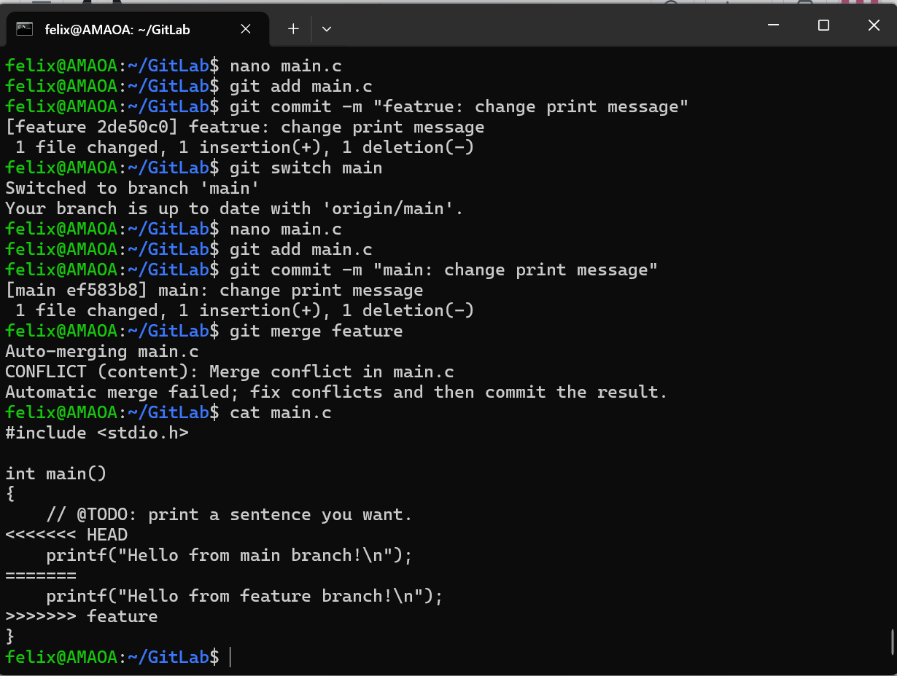
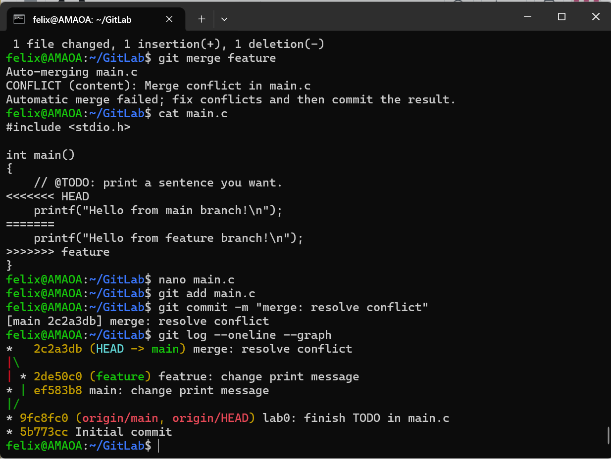

# Lab0: GitLab 实验报告

- 姓名：毛承一
- 学号：25800190007
- 日期：2026-09-14

## 一、文档问题回答（任务 1）

### 1. 你之前有过多人协同开发的经历吗？如果有，你们是使用什么方式分工协作的？

没有。本次是我第一次接触版本控制工具与团队协作开发流程，此前没有参与过多人共同开发的软件项目。通过本次实验，我初步了解了多人协作时如何用 Git 管理代码。

### 2. 思考一下，Git 为什么要设计"暂存-提交"两个步骤？

我认为"暂存-提交"两步设计的好处主要有三点：

1. **提交内容可分组、可审查**：开发过程中通常会同时产生多处修改，暂存区允许我先把想提交的改动 `git add` 进去，检查无误后再 `git commit`，从而形成一个个逻辑清晰、互不混杂的提交点；
2. **支持原子提交**：可以把一次功能相关的所有改动归入同一个提交，之后回溯（`git log` / `git reset`）时能明确知道"这次提交做了什么"；
3. **降低误操作成本**：暂存区提供了"反悔"的机会——如果发现暂存了不想要的内容，可以用 `git restore` 取消暂存，而不必担心立即写入历史。

本质上，Git 用"工作区 → 暂存区 → 仓库"的三级结构，把"修改"和"记录"两个动作解耦，让版本控制更精细、更可控。

### 3. `git branch` 和 `git branch -a` 的区别是什么？

- `git branch`：只列出**本地仓库**的分支（例如 `main`、`feature`）；
- `git branch -a`（`--all`）：在本地分支之外，还会列出**远程跟踪分支**（例如 `remotes/origin/main`），即同时显示本地和远程的全部分支。

## 二、实验步骤

### 1. 环境准备

1. 在 Windows 上安装 WSL 与 Ubuntu，并在 Ubuntu 中安装 Git，用 `git --version` 验证安装成功；
2. 配置 Git 身份：
   ```bash
   git config --global user.name "amao"
   git config --global user.email "dddevilfish17701@gmail.com"
   ```
3. 注册 GitHub 账号，生成 SSH 密钥对（`ssh-keygen -t ed25519`），将公钥添加到 GitHub（Settings → SSH and GPG keys），最后用 `ssh -T git@github.com` 验证，输出 `Hi dddevilfish17701-tech! You've successfully authenticated...` 表示配置成功。

### 2. 建立个人仓库

1. 打开课程模板仓库 `https://github.com/ICS-26Fall-FDU/GitLab`，点击 **Use this template → Create a new repository**，创建个人仓库 `dddevilfish17701-tech/GitLab`；
2. 克隆到本地：
   ```bash
   git clone git@github.com:dddevilfish17701-tech/GitLab.git
   cd GitLab
   ```

### 3. 任务 2：完成 `main.c` 中的 TODO

1. 用 `nano main.c` 编辑文件，将 `printf` 的内容改为自己想说的话，完成 `// @TODO` 注释要求的任务；
2. 可选编译运行验证：`make` → `./main` → `make clean`；
3. 提交并推送：
   ```bash
   git add main.c
   git commit -m "lab0: finish TODO in main.c"
   git push
   ```

### 4. 任务 4：分支管理与合并冲突

1. 创建并切换到 feature 分支：
   ```bash
   git switch -c feature
   ```
2. 在 feature 分支上修改 `main.c` 中 `printf` 的内容为 `"Hello from feature branch!\n"`，提交：
   ```bash
   git add main.c
   git commit -m "feature: change print message"
   ```
3. 切回 main 分支，将**同一行** `printf` 修改为 `"Hello from main branch!\n"`，提交：
   ```bash
   git switch main
   nano main.c   # 修改同一行内容
   git add main.c
   git commit -m "main: change print message"
   ```
4. 执行合并，出现冲突：
   ```bash
   git merge feature
   # 输出：CONFLICT (content): Merge conflict in main.c
   ```
5. 用 `nano main.c` 手动解决冲突：删除 `<<<<<<< HEAD`、`=======`、`>>>>>>> feature` 三个冲突标记，只保留期望的内容；
6. 完成合并提交：
   ```bash
   git add main.c
   git commit -m "merge: resolve conflict"
   ```
7. 用 `git log --oneline --graph` 查看合并历史，可以看到分叉合并图；最后 `git push` 推送到 GitHub。

## 三、阅读心得（任务 3）

我选读了《Gitflow 使用规范》和《语义化版本 2.0.0》两篇文章。

### 1. Git Flow 分支控制（dafaycoding.com/article/git-gif-flow）

这篇文章介绍了一种成熟的分支管理策略 Gitflow。它把分支分为五类，各司其职：

| 分支 | 类型 | 作用 |
|---|---|---|
| master | 永久 | 与线上运行代码一致，每次发布打 tag |
| develop | 永久 | 开发主干，团队成员日常开发的公共分支 |
| feature | 临时 | 新功能开发，从 develop 创建，完成后合并回 develop 并删除 |
| release | 临时 | 版本提测与发布准备，从 develop 创建，完成后合并 master 和 develop |
| hotfix | 临时 | 线上紧急 bug 修复，从 master 创建，修复后合并 master 和 develop |

文章强调的核心原则是"**从哪里来，最后回到哪里去**"：每个分支从固定来源创建，完成后合并回固定去向，这样不同分支职责清晰，能有效避免多人协作中的代码冲突和版本混乱。

### 2. 语义化版本（semver.org）

这篇文章定义了语义化版本控制（SemVer）规范：版本号格式为 **主版本号.次版本号.修订号（X.Y.Z）**，递增规则如下：

- **主版本号**：做了不兼容的 API 修改时递增；
- **次版本号**：做了向下兼容的功能性新增时递增；
- **修订号**：做了向下兼容的问题修正时递增。

此外还规定了先行版本号（如 `1.0.0-alpha`）与版本编译信息（如 `+001`）的写法，以及版本优先级的比较规则。其核心思想是：**版本号本身应该传达"这次改动的影响范围"**，让依赖管理变得可预期，从而避免"依赖地狱"。

### 3. 我对"为什么要学习 Git"的理解

Git 是现代软件开发的基础设施。它记录了文件的每一次修改，可以随时回溯到任意版本，也是多人协作的前提——没有版本控制，团队合并代码只能靠逐行复制，效率极低且容易出错。学会 Git，才能真正参与真实的项目开发；理解了 Git 背后的暂存/提交、分支、合并机制，也才能理解 Gitflow、SemVer 这些工作流与规范的设计动机。本次实验让我从零掌握了 `clone / add / commit / push / branch / merge / 冲突解决` 等核心操作，为后续实验和未来的开发打下了基础。

## 四、实验截图

- 截图 1：在 main 分支合并 feature 分支时出现冲突（`git merge feature` 输出 `CONFLICT (content): Merge conflict in main.c`，`cat main.c` 显示两个分支对同一行 `printf` 的冲突标记）

  

- 截图 2：解决冲突并完成合并（用 nano 删除冲突标记、保留期望内容，`git commit -m "merge: resolve conflict"` 提交，`git log --oneline --graph` 显示合并提交历史）

  

## 五、建议

（可选）建议实验文档可以把模板仓库链接放到更显眼的位置，方便第一次使用的同学快速找到。
